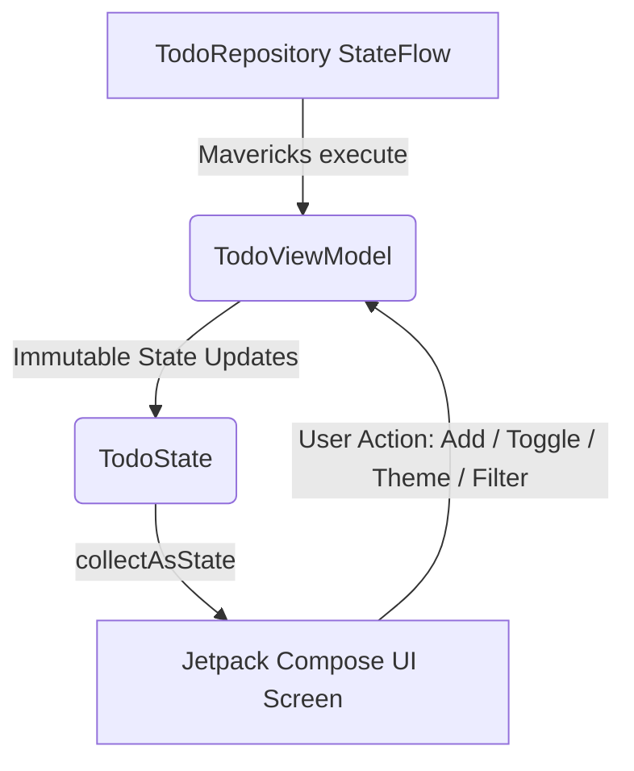

# 📱 Jetpack Compose TodoApp (MvRx Architecture)


A modern, high-performance, pure **Jetpack Compose** Android application built with **Airbnb Mavericks (MvRx 3.0)** architecture framework, Kotlin Coroutines, dynamic **Dark & Light Mode**, **Zomato-style motion transitions**, native **SplashScreen API**, and a sleek Material 3 design system.

---

## ✨ Features

- ⚡ **Airbnb Mavericks (MvRx) State Management**: Unidirectional state flow with immutable state (`MavericksState`) and reactive state reducers (`MavericksViewModel`).
- 🌗 **Dynamic Dark & Light Mode Theme**: Seamless switching between dark glassmorphism and crisp light theme palettes with automatic status bar synchronization.
- 🎬 ** Motion & Splash Screen**: Signature style animated brand splash overlay with pulse scale logo, smooth vertical slide-up exit, and fluid list transitions.
- 🎨 **Custom Adaptive Launcher Icon**: Custom vector adaptive icon with glowing neon checkmark badge and indigo gradient background.
- 📱 **Native SplashScreen API**: Integrated `androidx.core:core-splashscreen` (Android 12+ API) for instant cold start splash animations.
- 🏷️ **Categorization & Filtering**: Filter tasks seamlessly by categories (**Work**, **Personal**, **Shopping**, **Health**, **Finance**).
- 🚩 **Priority Management**: Color-coded badges for task urgency (**Low**, **Medium**, **High**, **Urgent**).
- 📊 **Productivity Stats Overview**: Real-time stats card tracking total completed tasks, remaining workload, and completion percentage.
- 📝 **Subtask Checklists**: Expandable todo cards with interactive subtask checklists and progress indicators.
- 🔍 **Live Search**: Instant real-time keyword search across task titles and descriptions.
- ➕ **Modal Bottom Sheets**: Animated sheet for creating and updating tasks with custom selectors.

---

## 🏗️ Tech Stack & Architecture

| Layer | Technology |
|---|---|
| **Language** | Kotlin 2.0 |
| **UI Toolkit** | Jetpack Compose (Material 3) |
| **Architecture** | MvRx (Airbnb Mavericks 3.0) |
| **Theme System** | Dynamic Material 3 Light & Dark Mode |
| **Splash System** | `androidx.core:core-splashscreen` & Compose Motion |
| **Async & Flow** | Kotlin Coroutines & `StateFlow` |
| **Dependency Catalog** | Gradle Version Catalog (`libs.versions.toml`) |
| **Build System** | Gradle Kotlin DSL (`.gradle.kts`) |

### MvRx State Architecture



---

## 📂 Project Structure

```
todoapp/
├── gradle/
│   └── libs.versions.toml             # Dependency catalog
├── app/
│   ├── src/main/
│   │   ├── AndroidManifest.xml
│   │   ├── res/                        # Vector launcher icons, Splash theme
│   │   └── java/com/example/todoapp/
│   │       ├── TodoApplication.kt      # Initializes Mavericks.initialize(this)
│   │       ├── MainActivity.kt         # Compose & SplashScreen entry point
│   │       ├── model/                  # TodoItem, SubTask, Category, Priority
│   │       ├── repository/             # TodoRepository (Reactive flow data source)
│   │       ├── mvrx/                   # TodoState & TodoViewModel (Mavericks MvRx)
│   │       └── ui/
│   │           ├── TodoScreen.kt       # Main screen with MvRx state & Zomato splash motion
│   │           ├── theme/              # Color, Type, Theme (Dark & Light Material3 UI)
│   │           └── components/         # StatsCard, CategoryChipGroup, TodoItemCard, etc.
```

---

## 🚀 Getting Started

### Prerequisites
- **Android Studio** Ladybug or newer
- **JDK 17** or higher
- **Android SDK** Level 35

### Build & Run
1. Clone the repository:
   ```bash
   git clone https://github.com/KarthikMachaiah/todoapp.git
   ```
2. Open the project in **Android Studio**.
3. Sync Gradle and run on an Android Emulator or connected device (Min SDK: 26+).

---

## 👤 Author

**Karthik Machaiah**
- Email: [karthikmachaiah@gmail.com](mailto:karthikmachaiah@gmail.com)
- GitHub: [@KarthikMachaiah](https://github.com/KarthikMachaiah)
